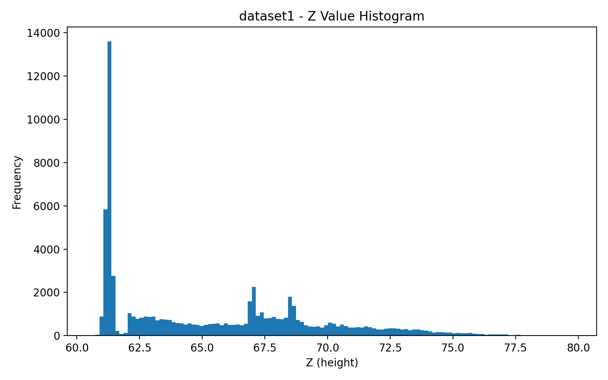
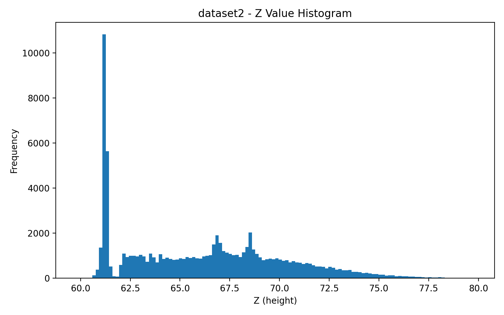
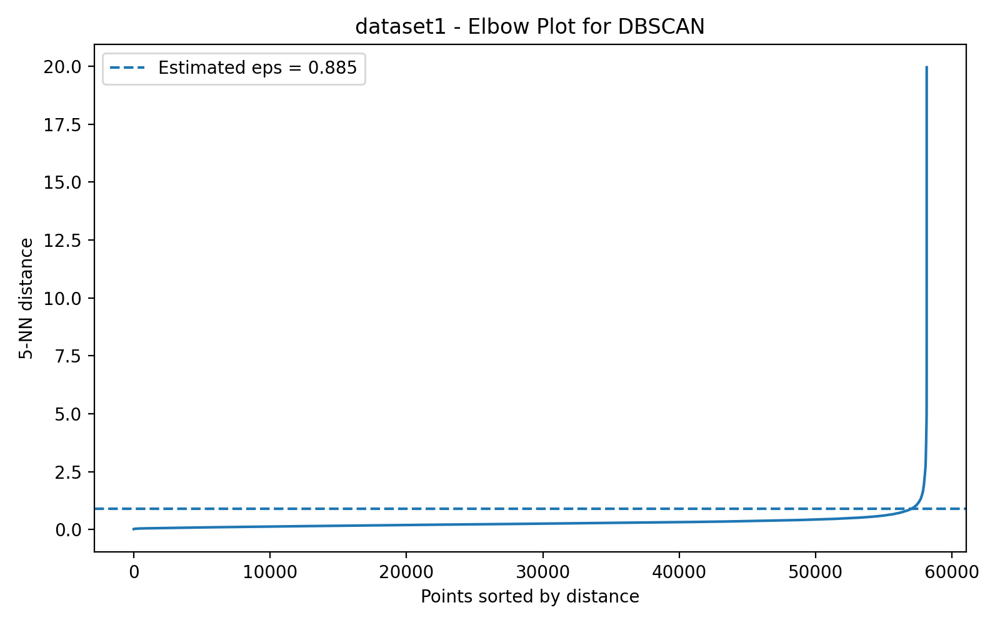
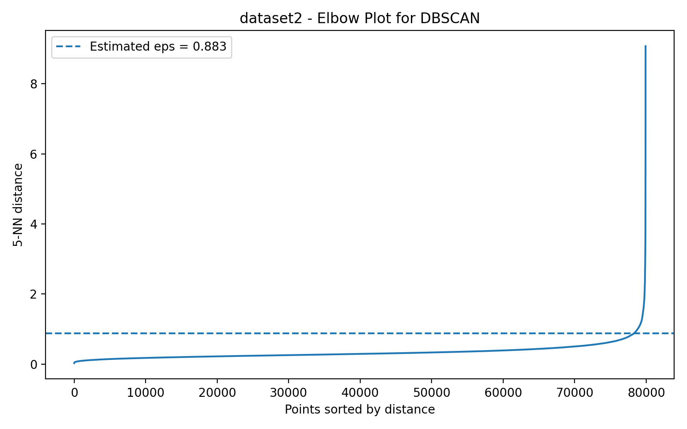
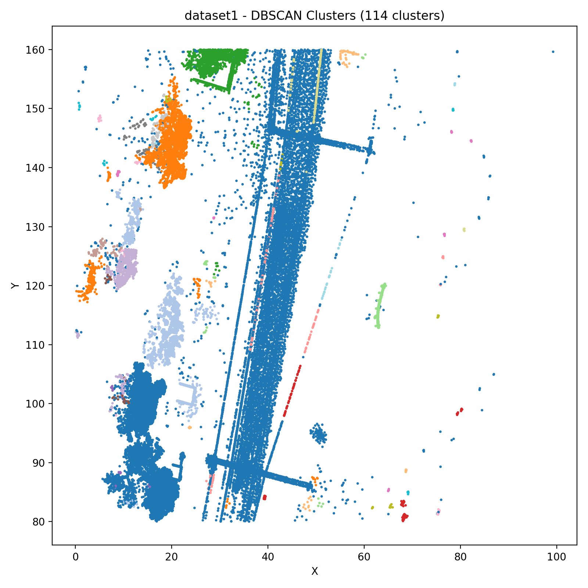
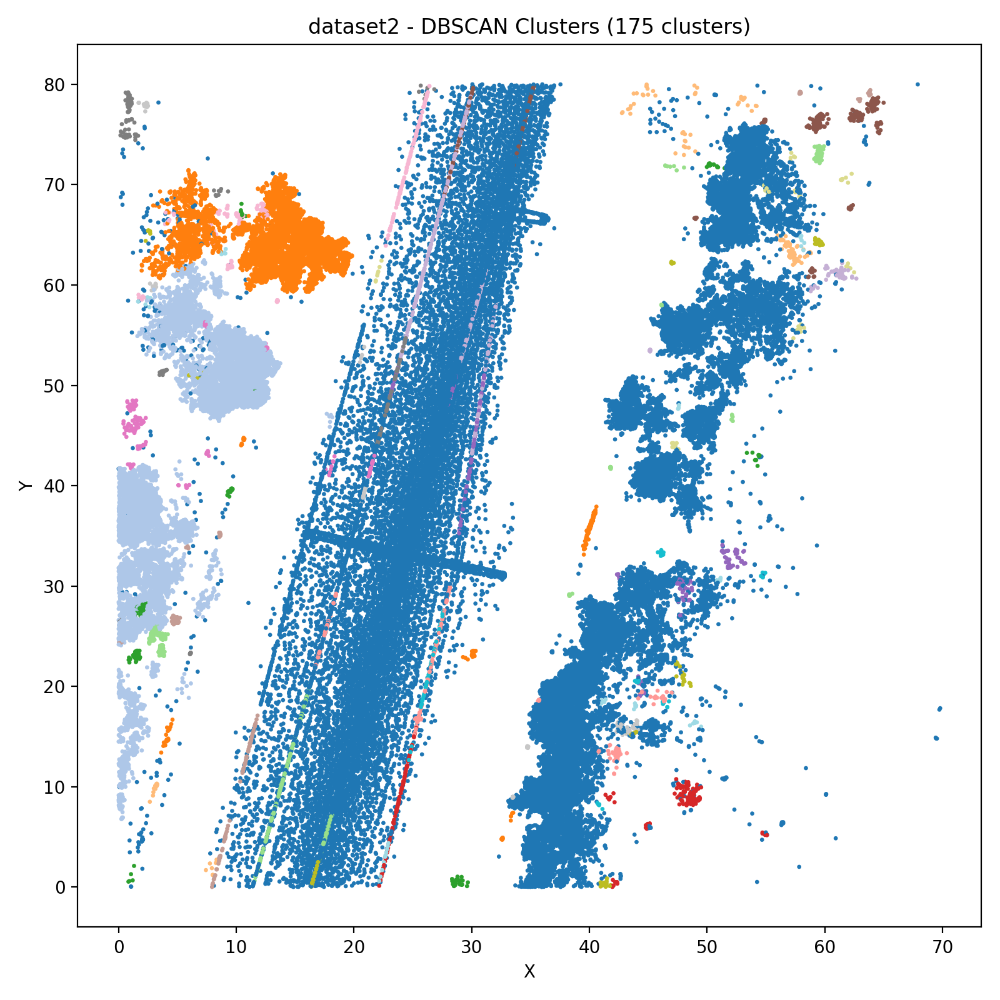
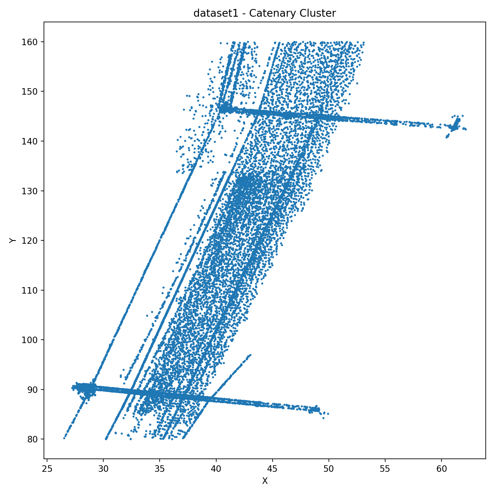
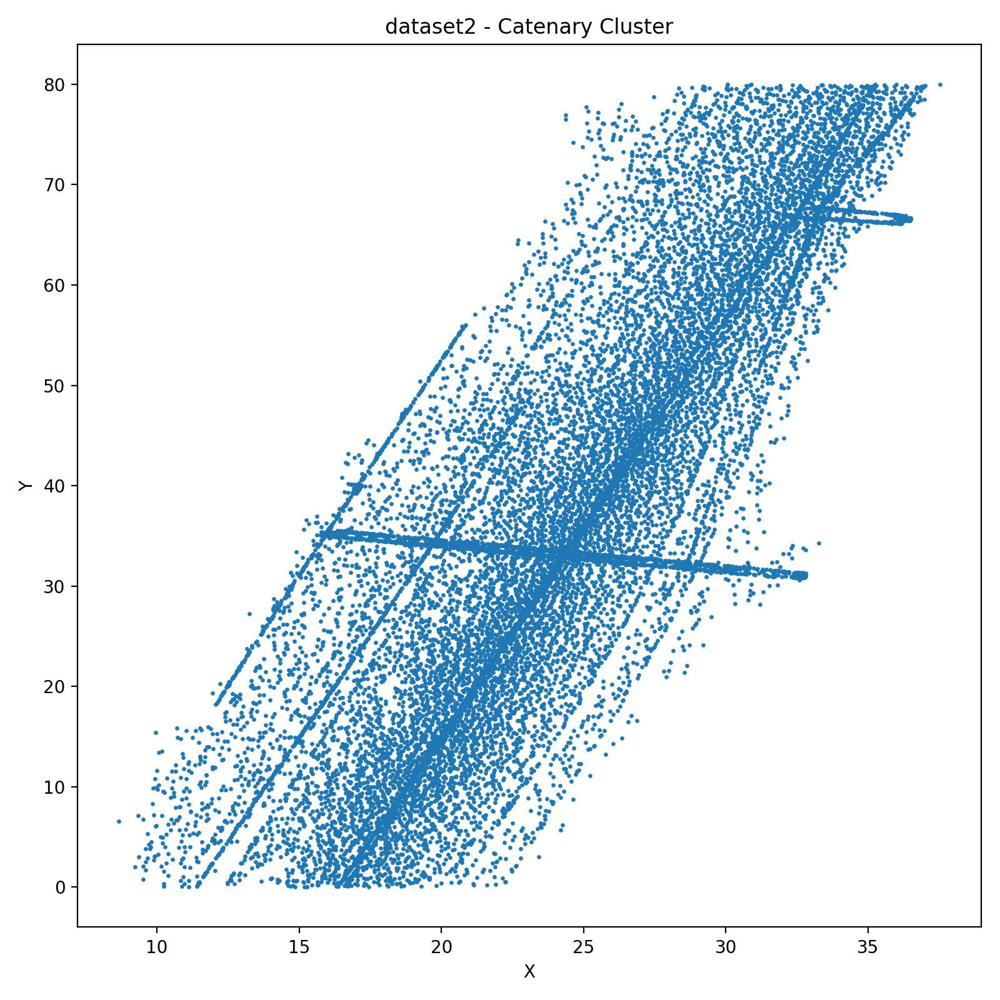

# LiDAR Point Cloud Processing

This project processes LiDAR point cloud data using Python.  
Each point consists of (x, y, z) coordinates.

The goal is to:
- Detect the ground level
- Apply clustering using DBSCAN
- Extract the largest cluster (catenary)

---

## Task 1 — Ground Detection

The ground level is estimated using a histogram of Z-values.  
The peak (most frequent value) represents the ground.

### Results:
- dataset1 ground level: **61.297663**
- dataset2 ground level: **61.181925**

### Histogram Plots:

---

## Task 2 — DBSCAN Clustering

The optimal eps value is determined using the elbow method based on k-nearest neighbors.

### Results:
- dataset1 eps: **0.884731**
- dataset2 eps: **0.883465**

Clusters found:
- dataset1: 114 clusters
- dataset2: 175 clusters

### Elbow Plots:

### Cluster Plots:

---

## Task 3 — Catenary Detection

The largest non-noise cluster was selected based on the span in X and Y.

### Results:

### dataset1:
- min(x): 26.498000  
- min(y): 80.012000  
- max(x): 62.140000  
- max(y): 159.997000  

### dataset2:
- min(x): 8.652000  
- min(y): 0.005000  
- max(x): 37.538000  
- max(y): 79.998000  

### Catenary Plots:

---

## How to Run

1. Install dependencies:
pip install numpy matplotlib scikit-learn
2. Run the script:
python share.py
---

## Project Structure
.
├── README.md
├── share.py
├── dataset1.npy
├── dataset2.npy
├── images/
│ ├── dataset1_histogram.png
│ ├── dataset1_elbow_plot.png
│ ├── dataset1_clusters.png
│ ├── dataset1_catenary.png
│ ├── dataset2_histogram.png
│ ├── dataset2_elbow_plot.png
│ ├── dataset2_clusters.png
│ ├── dataset2_catenary.png
.
---

## Summary

- Ground level detected using histogram
- DBSCAN used for clustering
- Largest cluster identified as catenary

The method produced consistent results for both datasets.
